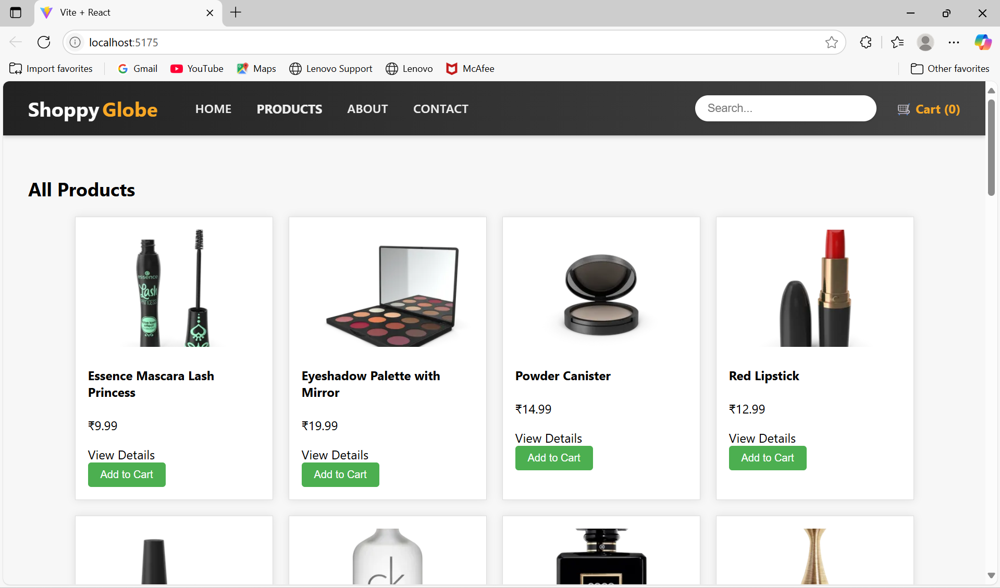

# React + Vite

This template provides a minimal setup to get React working in Vite with HMR and some ESLint rules.

Currently, two official plugins are available:

- [@vitejs/plugin-react](https://github.com/vitejs/vite-plugin-react/blob/main/packages/plugin-react) uses [Babel](https://babeljs.io/) for Fast Refresh
- [@vitejs/plugin-react-swc](https://github.com/vitejs/vite-plugin-react/blob/main/packages/plugin-react-swc) uses [SWC](https://swc.rs/) for Fast Refresh

## Expanding the ESLint configuration

If you are developing a production application, we recommend using TypeScript with type-aware lint rules enabled. Check out the [TS template](https://github.com/vitejs/vite/tree/main/packages/create-vite/template-react-ts) for information on how to integrate TypeScript and [`typescript-eslint`](https://typescript-eslint.io) in your project.

# 🛍️ Shoppy Globe

A modern e-commerce web application built using **React** and **Vite**, showcasing a product catalog, cart system, and responsive design.

---

## 📸 Screenshot



---

## 🚀 Features

- Product listing with images, prices, and descriptions
- "Add to Cart" functionality
- Cart summary with item count
- Navigation with Home, Products, About, Contact pages
- Responsive design using CSS Flex/Grid
- Clean and modern UI

---

## 🧑‍💻 Technologies Used

- [React](https://reactjs.org/)
- [Vite](https://vitejs.dev/)
- JavaScript (ES6+)
- CSS3 / Flexbox / Grid

---

## ⚙️ Getting Started

### 📦 Install dependencies

```bash
npm install

---

Once you've added this, commit it:

```bash
git add README.md public/screenshot.png
git commit -m "Add README and app screenshot"
git push
